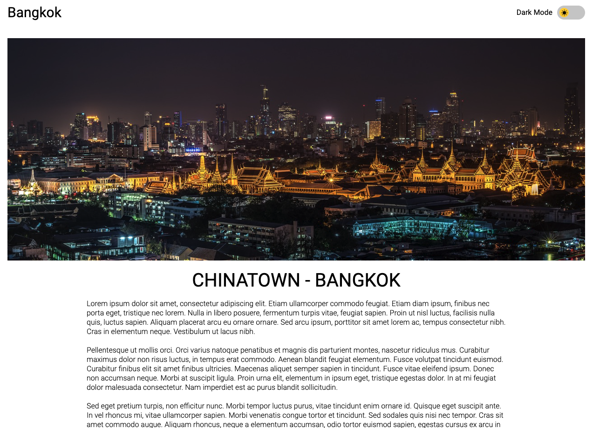
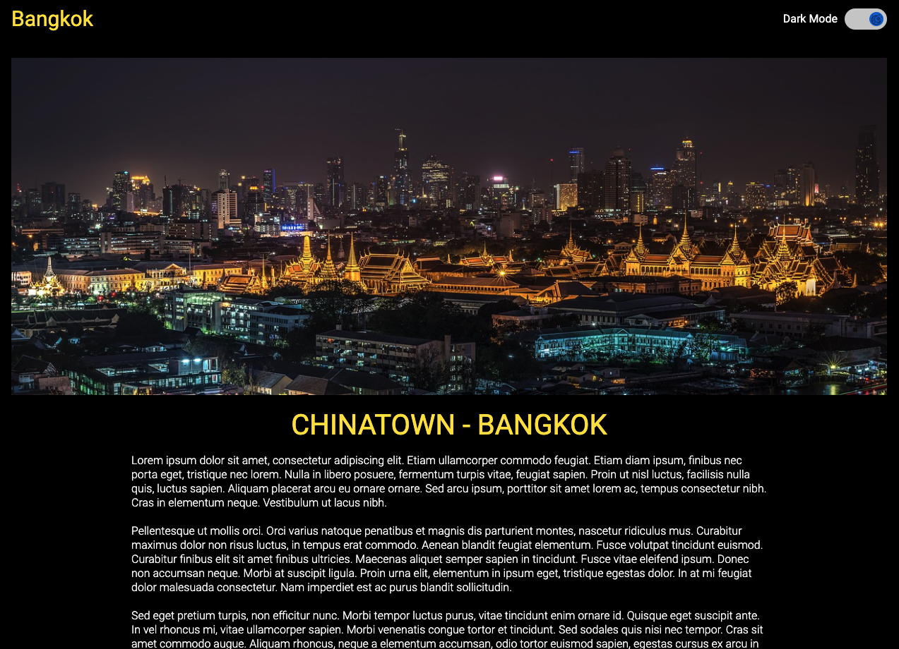
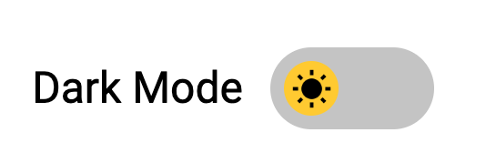

## Web con modo oscuro 
Vamos a hacer que la web tenga dos versiones. la versión normal y la versión modo oscuro. ¿Eso qué significa? Que tendremos qu cambiar todo el aspecto de nuestra web pulsando un botón.

Será algo similar a lo siguiente

Web modo normal:

Web modo oscuro:

Botón para que cambie:

Tienes la estructura de carpetas y archivos hecha, pero están vacios... así que tendrás que crear tu estructura HTML y "enganchar" el CSS y JS y comenzar a trabajar.

# ¿Qué tengo que hacer?
Lo primero que deberás hacer es la web en modo normal. Bien maquetada con sus etiquetas semánticas, y lo más similar a la primera imagen. Con sus fondos blancos, sus textos en color negro, ...
También tendrás que hacer el botón de `Dark Mode` no tiene porque usarse como una etiqueta botón, pueden ser varios DIVs

Cuando pulsemos sobre él tendremos que pasar al modo oscuro.

# ¿Cómo hago eso de modo oscuro?
En el momento que pulsemos en el switch `Dark Mode` cambiarán las CSS. Una buena solución será haciendo un `toggle` y haciendo que se añadan CSS nuevas.

Cuando vuelvas a clickar en el botón de volverá todo a la normalidad 

# PISTAS
Hay 3 cosas que tienes que tener en cuenta:
- El togle lo que hace es como un interruptor ON/OFF. al pulsar sobre él enciende y cuando vuelves a pulsar deja de estar encendido
- Ese toggle sucederá en el momento que se clicke en un elemento. Por tanto es un evento 
- Añadir clases a ciertos elementos es sencillo con el atrubuto classList

Recuerda que si una CSS tiene otor elemento por encima es más definida y el valor prevalece sobre la otra. Por ejemplo no es lo mismo el valor que pueda tener `p` dentro de una clase `dark-mode` que sin esa clase.

En resumen deberás clickar en el elemento y pasar a modo oscuro y al volver a clickar colverá a la normalidad

Revisa la documentación de classList con toggle. En esa página hay otras maneras para poder resolverlo
https://developer.mozilla.org/en-US/docs/Web/API/Element/classList

# CONSEJOS
- Comienza maquetando la web en modo normal
- Haz el botón `Dark Mode` sin pensar en que se vaya a mover el círculo
- Haz que al clickar en el botón del `Dark Mode` se añadan CSS 
- Cambia las CSS anidando clases para generar ese modo oscuro
- Haz que el círculo también se mueva cuando se haga click en el botón `Dark Mode`
